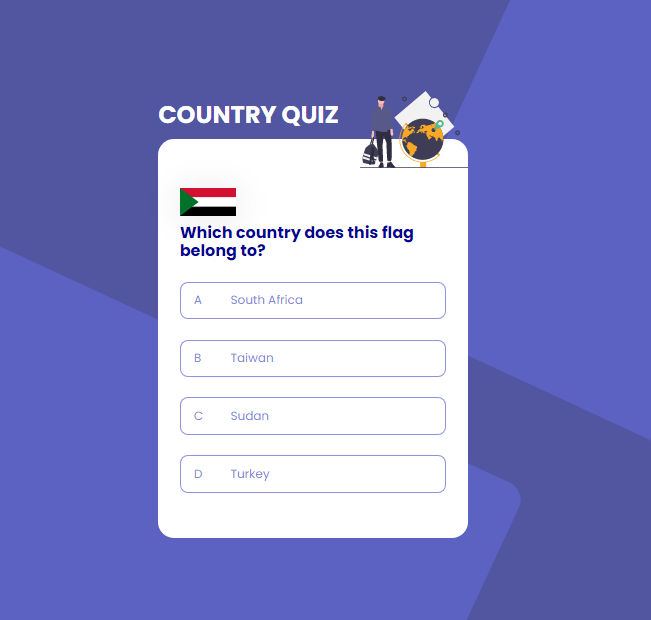
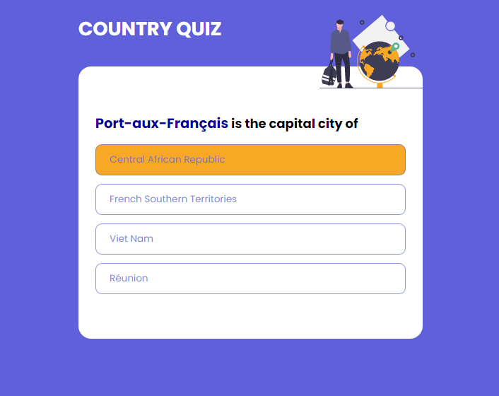
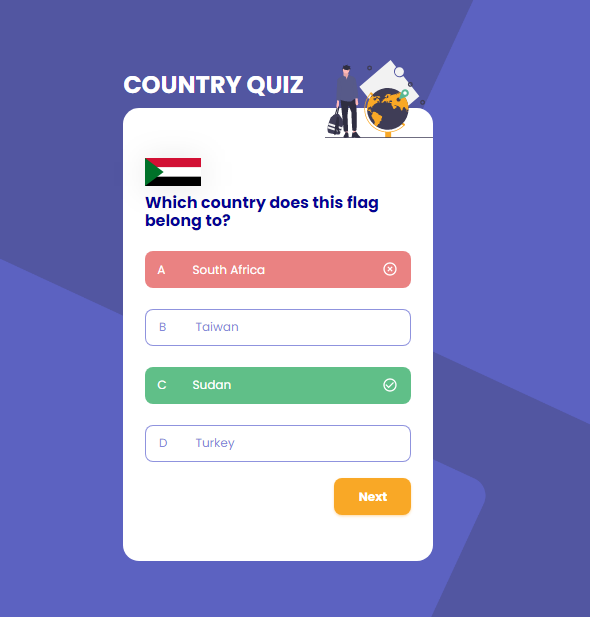
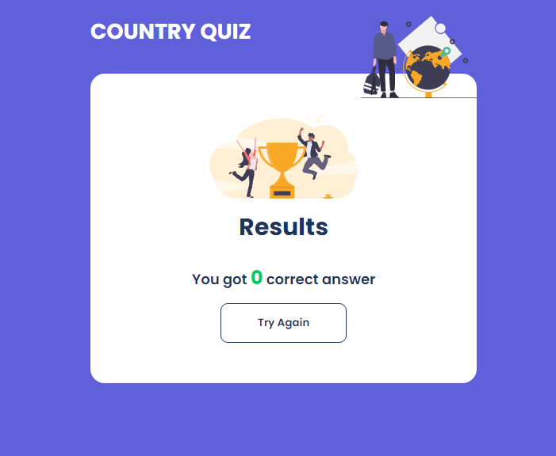

# Country Quiz

Challenge: Create a country quiz app using an API, and use React to handle the frontend. Don’t look at the existing solution. Fulfill user stories below:


-   User story: I can see at least 2 types of question: a city is the capital of.. or a flag belong to country..
-   User story: I can see select an answer
-   User story: I can see if my answer is correct or incorrect
-   User story: When I answer correctly, I can move on to the next question
-   User story: When I answer incorrectly, I can see my results and try again
-   User story: I can try again

**Icon**: https://google.github.io/material-design-icons/

**API**: https://restcountries.eu/. Use data from the API to create questions and answers.

**Design** : https://www.figma.com/file/Gw0ZNBbYN8asqFlZWy3jG1

**Live app** : https://country-quiz-app.netlify.app/

As long as you fulfill all the user stories, you can give your personal touches by adding transition, using your own images, changing colors, or even creating your own layout,...

Once you completed, submit your solutions by providing URLs for both GitHub repository and live app on Netlify and explain briefly what you have done.

For the custom domain url you'll enter in netlify, please use the following naming convention : **country-quiz-_YOUR_FIRSTNAME_.netlify.app** (replace YOUR_FIRSTNAME by your firstname)

Good luck everybody!

Template for your readme :

<!-- Please update value in the {}  -->

<h1 align="center">{Your project name}</h1>

<div align="center">
  <h3>
    <a href="https://country-quiz-noeline.netlify.app/">
      Demo
    </a>
    <span> | </span>
    <a href="https://github.com/vakodrazan/country-quiz">
      Solution
    </a>
  </h3>
</div>

<!-- TABLE OF CONTENTS -->

## Table of Contents

-   [Overview](#overview)
    -   [Built With](#built-with)
-   [Features](#features)
-   [How to use](#how-to-use)
-   [Contact](#contact)
-   [Acknowledgements](#acknowledgements)

<!-- OVERVIEW -->

## Overview


Introduce your projects by taking a screenshot or a gif. Try to tell visitors a story about your project by answering:






 ### Where can I see your demo?

You can find my demo in [country-quiz](https://country-quiz-noeline.netlify.app/).

 ### What was your experience?

 -It was hard to fetch the data from the API. 
 - I noticed that we need to run the random just once at the beginning. 
 - Also, we need to be creative to get the flag and the capital randomly.
 - I had a trouble to get each attribute from each object. But then, I noticed that I need to pass an argument and a parameter when calling it.

 ### What have you learned/improved?
 - I have learnt how to random and only show four of the item form a 250 item from the API. 
 - I learnt that we can have an `ol` or `ul` that has a different type such as `type="A"`.
 - Before it was not clear for me how to use index when mapping. But in this project, sometime I got two item that has the same key so I have to find out what I should do to avoid that. Then I came up with an idea that I could use the unique code and add the index with it.

 ### Your wisdom? :)

 - It was hard to get that render. Especially, to get the question and the right value of that.
 - This project taught me to think before coding because there are some logic we need to know before delving into code.
 - I try to use hook context but I there was a problem with it.
 - I also tried to add an alphabet with the option list but it didn't work.

### Built With

<!-- This section should list any major frameworks that you built your project using. Here are a few examples.-->
-   [React](https://reactjs.org/)
-   [Parcel](https://parceljs.org/)
-   [Sass](https://sass-lang.com/)

## Features

<!-- List the features of your application or follow the template. Don't share the figma file here :) -->
-[Github](https://github.com/vakodrazan/country-quiz)

## How To Use

<!-- Example: -->

To clone and run this application, you'll need [Git](https://git-scm.com) and [Node.js](https://nodejs.org/en/download/) (which comes with [npm](http://npmjs.com)) installed on your computer. From your command line:

```bash
# Clone this repository
$ git clone https://github.com/your-user-name/your-project-name

# Install dependencies
$ npm install

# Run the app
$ npm start or $ parcel index.html
```

## Acknowledgements
<!-- This section should list any articles or add-ons/plugins that helps you to complete the project. This is optional but it will help you in the future. For example: -->


## Contact

-   Website [your-website.com](https://country-quiz-noeline.netlify.app/)
-   GitHub [@your-username](https://github.com/vakodrazan/country-quiz)
-   Twitter [@your-twitter](https://{twitter.com/your-username})
