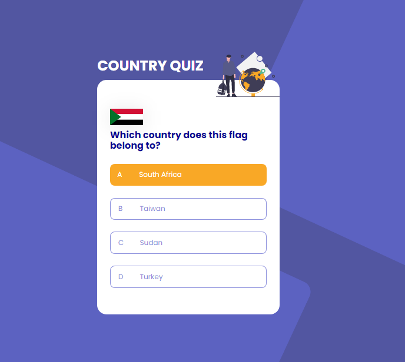

# Country Quiz

I create a country quiz app using an API, and use React to handle the frontend. I use react hooks. I store all the logic in a context file  and I can just crab them wherever I want it.





**Icon**: https://google.github.io/material-design-icons/

**API**: https://restcountries.eu/. I use data from the API to create questions and answers.

**Design** : https://www.figma.com/file/Gw0ZNBbYN8asqFlZWy3jG1

**Live app** : https://country-quiz-noeline.netlify.app/

 ## Experience:

 It was kind of hard to find the right URL to fetch from the api but there are some tips that they give based on what url we want to fetch.

 ## Structure

 - I need to random the question by four item each time and including the correct answer for the question. 
 - When the choice is right just give a new random when clicking the next button. But show the score and reset it when clicking a button when the choice the user made is wrong.
 - Also, highlight the correct answer or the answer clicked after clicking on each one of them.
 - All the logic stayed in the context file.

### Built With

<!-- This section should list any major frameworks that you built your project using. Here are a few examples.-->
-   [React](https://reactjs.org/)
-   [Parcel](https://parceljs.org/)
-   [Sass](https://sass-lang.com/)

 ## Installation and Setup Instructions

 To get started with this project. Clone this [repository](https://github.com/vakodrazan/country-quiz). You'll need react with it so just do the following steps.

## Prerequisite

```bash
# Clone this repository to your local computer
$ git clone https://github.com/vakodrazan/country-quiz

# Install dependencies
$ npm install

# Run the app
$ npm start or $ parcel index.html
```
